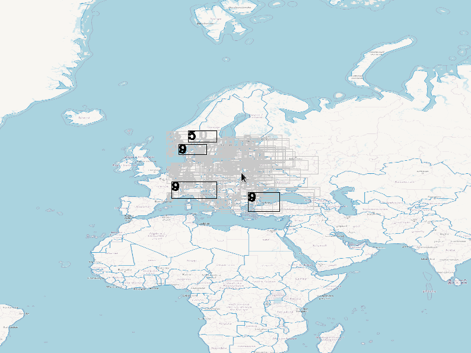
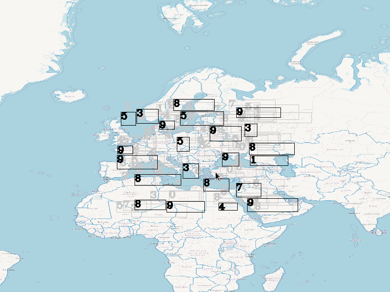

# LabelFilter

Basic implementation of map/chart decluttering labels algorithm.
It will determine which labels should be shown on the screen, and wchich should not, depending on the labels position, collisions and priority. Labels on the left are prefered.

There are two algorithms provided. "stable" and "showMore".

## Algorithms:

### Stable algorithm

Pros:
 - When label is displayed from far away - it will always be shown on close up
 
Cons:
 - Slightly slower
 - Less labels are displayed (due to collision propagation - look at the end of this document)


Visualization:




### showMore algorithm

Pros:
 - Slightly faster
 - No collision propagation - more labels are shown

Cons:
 - labels may show and dissapear at different level


Visualization:




# Compilation

```
mkdir build
cd build
cmake ..
make
```

# Testing environment (visual):
## Dependences

- opencv ( https://opencv.org/ )

install opencv from repository (https://github.com/opencv/opencv/releases) or you OS package manager e.g.:
```
pamac install opencv
```

## Testing

```
./test/LabelFilterTest ../test/img/map.png
```


## Why I've used sorting algorithm before collision detection?


## Future improvement


Author: Łukasz Bolda